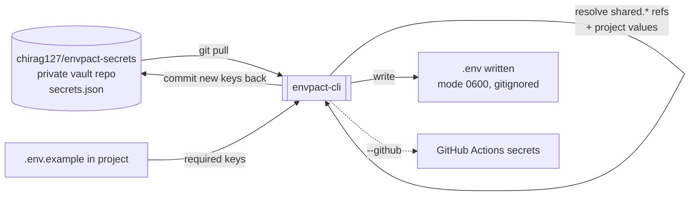

# envpact-cli

> One private vault, every project, zero infrastructure, $0 forever — a centralized, serverless, Git-backed secrets manager for solo devs juggling 100+ public repos.

[](https://opensource.org/licenses/MIT)
[](https://github.com/chirag127/envpact-npm-cli/stargazers)
[](https://github.com/chirag127/envpact-npm-cli/commits)
[](https://nodejs.org)
[](https://www.npmjs.com/package/envpact-cli)
[](https://github.com/chirag127/envpact-npm-cli/actions/workflows/ci.yml)
[](https://envpact-npm-cli.oriz.in)

Zero-dependency CLI for **envpact** — a centralized, serverless,
Git-backed secrets manager for solo developers managing 100+ public
GitHub repositories.

> One private vault, every project, zero infrastructure, $0 forever.

**Links:** [Repo](https://github.com/chirag127/envpact-npm-cli) · [Live docs](https://envpact-npm-cli.oriz.in) · [npm](https://www.npmjs.com/package/envpact-cli) · [envpact umbrella](https://chirag127.github.io/envpact/)

⭐ **If this is useful, please [star the repo](https://github.com/chirag127/envpact-npm-cli/stargazers)** — it helps other developers find it.

## Why envpact?

If you maintain dozens of public repos, you can't commit `.env`
files. You also can't afford to duplicate the same `OPENAI_API_KEY`,
`STRIPE_SECRET_KEY`, and `DATABASE_URL` across 40 projects — when
they leak or expire, rotation becomes a 200-step manual nightmare.

envpact solves this with a **single private GitHub repo** holding a
single `secrets.json` file. Project-specific secrets reference
shared secrets via a `shared.KEY_NAME` syntax. Rotate once → every
project resolves the new value on next run.

## How the CLI resolves secrets



## Installation

```bash
# Run with no install (recommended)
npx envpact-cli

# Or install globally
npm install -g envpact-cli
```

## Quick Start

```bash
# 1. Create your private vault (auto via gh CLI)
npx envpact-cli --init auto

# 2. In any project with a .env.example, generate the full .env
cd my-project
npx envpact-cli
# → resolves shared refs, prompts for missing values, writes .env

# 3. Sync a single key in either direction
npx envpact-cli --pull DATABASE_URL    # vault → .env
npx envpact-cli --push DATABASE_URL    # .env → vault

# 4. Check per-key sync state
npx envpact-cli --status

# 5. Sync secrets to GitHub Actions for CI/CD
npx envpact-cli --github
```

## How It Works

```
Your machine                 GitHub.com
─────────────────            ──────────────────────────
~/.envpact/secrets/  ←—git—→  chirag127/envpact-secrets (private)
                                ├── secrets.json
                                │   ├── shared: { OPENAI_API_KEY, … }
                                │   └── projects: { my-app: { … } }

cd my-project
envpact
  → reads .env.example
  → resolves "shared.OPENAI_API_KEY" → "sk-..."
  → writes .env (gitignored, mode 0600)
  → commits any new keys back to the vault
```

## Vault Schema

`secrets.json` (v3 — flat, single-environment, per-key timestamps):

```json
{
  "$schema": "https://envpact.oriz.in/schema/v3.json",
  "version": 3,
  "shared": {
    "OPENAI_API_KEY": {
      "value": "sk-proj-…",
      "_modified_at": "2026-06-19T10:00:00.000Z"
    }
  },
  "projects": {
    "my-app": {
      "OPENAI_API_KEY": {
        "value": "shared.OPENAI_API_KEY",
        "_modified_at": "2026-06-19T10:00:00.000Z"
      },
      "PORT": {
        "value": "3000",
        "_modified_at": "2026-06-19T10:00:00.000Z"
      },
      "DATABASE_URL": {
        "value": "postgresql://localhost/myapp",
        "_modified_at": "2026-06-19T10:00:00.000Z"
      }
    }
  }
}
```

**Resolution rules** (canonical, see [SHARED_SPEC §1](../envpact/blob/main/_build/specs/SHARED_SPEC.md)):

- Every leaf is an entry object: `{ value, _modified_at }`.
- A `value` starting with `shared.` is looked up one level in the
  `shared` block.
- A `value` starting with `enc:` is decrypted using your local age
  key (`~/.envpact/age.key`) at resolution time.
- There are NO per-environment objects in v3. One project, one set
  of values. Use multiple project names (e.g. `my-app-prod` /
  `my-app-dev`) or multiple vaults for environment isolation.

v1 (flat-string) and v2 (per-environment) vaults are auto-upgraded
in memory on read — a loud warning is logged because the per-env
flattening is lossy.

## Per-Key Sync (pull / push / status)

The CLI tracks per-key sync state in `.env.example.lock`, a small
JSON sidecar checked in alongside `.env.example`. It contains
timestamps only (no secret values).

| State | Meaning |
| :--- | :--- |
| `synced` | Local matches vault, lock matches vault |
| `local_newer` | User edited `.env` since last sync |
| `vault_newer` | Vault advanced since last sync |
| `both_diverged` | Local AND vault changed since last sync |
| `local_only` | Key in `.env`, absent from vault |
| `vault_only` | Key in vault, absent from `.env` |

`envpact --pull KEY` refuses on `local_newer` / `both_diverged`;
`envpact --push KEY` refuses on `vault_newer` / `both_diverged`.
Pass `--force` to override.

### Conflict timestamps (UTC + IST)

Every `--pull` / `--push` conflict prints both UTC and IST
timestamps for the vault and local sides, with `(Recommended —
newer)` highlighting whichever side is newer (per
[SHARED_SPEC §1.5](https://github.com/chirag127/envpact/blob/main/_build/specs/SHARED_SPEC.md)).
The vault is always the authoritative UTC source; IST is computed in
`Asia/Kolkata` and is independent of your machine's local timezone.

```
Conflict on KEY = OPENAI_API_KEY (project: my-app)

  Vault:  2026-06-19T07:30:00.000Z
          → 2026-06-19 13:00:00 IST   (Recommended — newer)
  Local:  2026-06-19T07:25:00.000Z
          → 2026-06-19 12:55:00 IST

  status: vault_newer
  Re-run with --force to overwrite local.
```

The `(Recommended — newer)` annotation is a hint, not an action —
you keep full control. Re-run with `--force` to override the refusal.

## Global `.env`

In addition to per-project `.env` files, envpact maintains a single
global file at `~/.envpact/.env` that mirrors every shared secret in
the vault — handy for shell scripts, one-off tooling, and any code
that doesn't have its own `.env.example`.

```bash
# Regenerate ~/.envpact/.env from ~/.envpact/.env.example.global
envpact --sync-global
# stderr: envpact: wrote ~/.envpact/.env (12 keys, 0 encrypted, 0 not in vault)
```

The owner-maintained template lives at
`~/.envpact/.env.example.global`. On first `--sync-global` run we
auto-create it as an alphabetical list of every `shared.*` key. Edit
the file at any time to reorder, add `# comments`, or omit keys you
don't want in the global mirror — the byte-faithful writer preserves
your layout exactly.

| Vault state | Resulting line in `~/.envpact/.env` |
| :--- | :--- |
| Plain shared value | `KEY=<value>` (quoted per dotenv rules) |
| Encrypted (`enc:…`) | `# KEY: encrypted — decrypt via CLI` |
| Missing from vault | `# KEY: not in vault` |

The mirror is read-only with respect to the vault — there is no
`--push-global`. Mutate via `envpact --add-shared KEY=VALUE` or the
dashboard; then re-run `--sync-global` to refresh the file.

The global file is written with mode `0600` (best-effort on
Windows) and is gitignored by convention — never commit it.

## Commands

| Command | Action |
| :--- | :--- |
| `envpact` | Generate full `.env` for the current project from the vault |
| `envpact --init auto` | Create vault repo + clone via gh CLI |
| `envpact --init <git-url>` | Clone an existing vault repo |
| `envpact --pull <KEY>` | Pull a single key from vault → `.env` (refuses if local is newer) |
| `envpact --push <KEY>` | Push a single key from `.env` → vault (refuses if vault is newer) |
| `envpact --status` | Show per-key sync status table |
| `envpact --force` | Override conflict refusals on `--pull` / `--push` |
| `envpact --sync-global` | Regenerate `~/.envpact/.env` from `~/.envpact/.env.example.global` |
| `envpact --github` | Sync resolved secrets to GitHub Actions |
| `envpact --rotate <KEY>` | Rotate a shared secret interactively |
| `envpact --list` | List all projects in the vault |
| `envpact --list-shared` | List shared secret names (values masked) |
| `envpact --add KEY=VALUE` | Add a project secret |
| `envpact --add-shared KEY=VAL` | Add a shared secret |
| `envpact --encrypt KEY` | Encrypt a shared secret in place (via age) |
| `envpact --dry-run` | Print what would be written |

Run `envpact --help` for the full flag list.

## Authentication

The CLI auto-detects which auth method to use, in this order:

1. **gh CLI** — if `gh auth status` succeeds, uses HTTPS via gh.
2. **SSH** — if `~/.ssh/id_ed25519` (or `id_rsa`) is present.
3. **HTTPS PAT** — if `GITHUB_TOKEN` env var is set.
4. **Plain HTTPS** — git's stored credentials.

## Configuration

envpact-cli is zero-config for the common path. These environment
variables influence behaviour (names + purpose only):

| Variable | Purpose |
| :--- | :--- |
| `GITHUB_TOKEN` | HTTPS PAT fallback for cloning/pushing the vault repo when gh CLI and SSH are unavailable. |
| `ENVPACT_HOME` | Override the default `~/.envpact/` location for the cloned vault and global `.env`. |

No secret values are ever stored in this repo. The vault itself is
your own private GitHub repository.

## Tech stack

- **Node.js** (>=18), CommonJS, **zero runtime dependencies**.
- Shells out to `git` and (optionally) `gh` and `age`.
- Bin: `envpact` (package `envpact-cli`).

## Repo structure

```
bin/envpact.js   # CLI entrypoint (the `envpact` bin)
lib/*.js         # resolution, sync, git, encryption helpers
tests/*.test.js  # node:test suite
docs/            # full reference (served at envpact-npm-cli.oriz.in)
```

## Encryption (opt-in)

If you want defense-in-depth on top of the private repo:

```bash
# One-time setup (creates ~/.envpact/age.key)
envpact --encrypt OPENAI_API_KEY

# Subsequent reads decrypt transparently if age + key are present.
```

Requires the [age](https://github.com/FiloSottile/age) binary.

## Security Model

- The vault repo MUST be private. envpact only reduces
  duplication and enables rotation; the trust root is GitHub.
- `.env` files are written with mode 0600 and added to
  `.gitignore` automatically.
- `--list-shared` only ever prints names (values masked).
- Encryption is opt-in per secret; never auto-encrypted.

## Multi-Component Ecosystem

| Component | Install |
| :--- | :--- |
| **envpact-cli** | `npx envpact-cli` (this) |
| envpact-mcp | MCP server for AI agents |
| envpact (Python) | `pip install envpact` |
| envpact-action | `chirag127/envpact-action@v0` (GitHub Action) |
| envpact-vscode | "envpact" in VS Code Marketplace |
| envpact-dashboard | https://envpact.oriz.in |

## Related projects — the envpact ecosystem

| Repo | Role |
| :--- | :--- |
| [envpact](https://github.com/chirag127/envpact) | Core (Python) vault library |
| **envpact-npm-cli** | Zero-dependency Node CLI (this repo) |
| [envpact-mcp-server](https://github.com/chirag127/envpact-mcp-server) | MCP server for AI agents |
| [envpact-gh-action](https://github.com/chirag127/envpact-gh-action) | GitHub Action — resolve secrets in CI |
| [envpact-registry-publisher-npm-cli](https://github.com/chirag127/envpact-registry-publisher-npm-cli) | Publish MCP servers to every registry |

## Part of the oriz family

One of ~80 [oriz](https://blog.oriz.in) projects — small, sharp,
open-source tools. The live docs run **$0 on the Cloudflare free tier**.

## Contributing

PRs welcome. Conventional commits are the changelog.

## Status

**Stable.** Published to npm as `envpact-cli`.

## License

MIT © 2026 Chirag Singhal · chirag@oriz.in — see [LICENSE](./LICENSE).

## Documentation

- **[Repo docs (`docs/README.md`)](./docs/README.md)** — full API + usage reference for envpact-cli
- **[Project umbrella site](https://chirag127.github.io/envpact/)** — overview of all envpact components, security model, quick start
- **[Live dashboard](https://envpact.oriz.in)** — visual vault management
